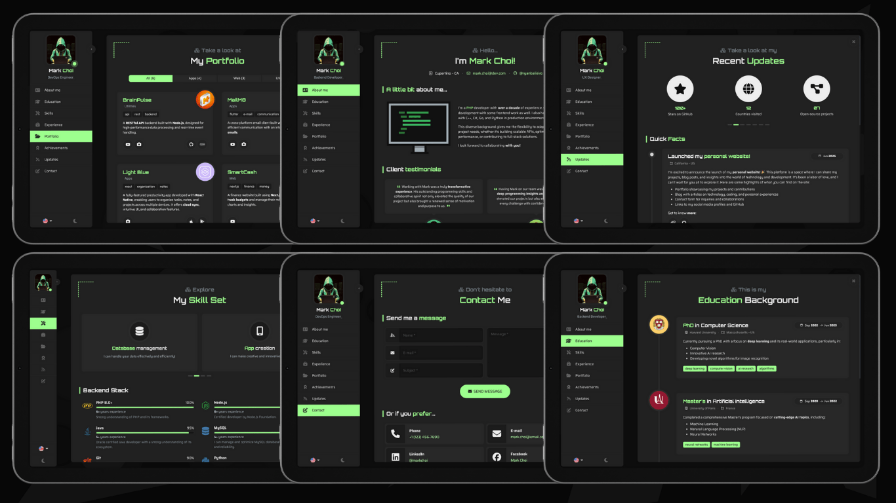
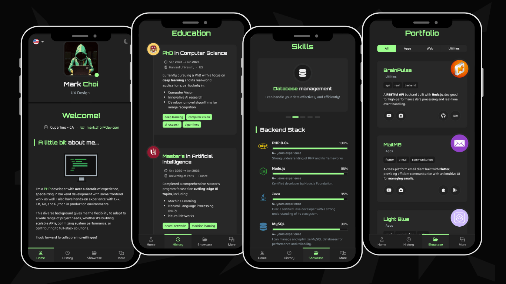

Key features:
- Lightweight and fully responsive.
- Adapts perfectly to mobile screens.
- Multi-language support included.
- Comes with both dark and light theme options.
- A variety of components to highlight your work experience, education, skills, portfolio, and more.
- Uses **Vite** for packaging.
- Emails with **EmailJS** - no backend needed!

## Layout and concept

### 1. Desktop Screenshots
The main view transitions smoothly when a new page is selected from the sidebar, giving a page-flipping effect. The sidebar is also toggleable, allowing the content area to expand for a larger viewing space.



### 2. Mobile Screenshots
On mobile, the layout groups the portfolio sections into categories and transforms into a tabbed interface with a bottom navigation.



## Getting Started

1. Clone the repo:
```
git clone 
```

2. Go to the project's root folder and use npm to install all required components:
```
npm install
```

3. Launch the project in developer mode:
```
npm run dev
```


Additional frameworks and plugins used include:
- **Smooth Scrollbar**: A customizable scrollbar plugin.
- **Swiper**: A powerful library for creating touch sliders.
- **EmailJS**: A free service that allows you to send emails using JavaScript.
- **Font Awesome**: A library of free vector icons.
- **PrimeIcons**: A collection of premium line icons.

## Copyright and License

Code released under the [MIT](https://github.com/StartBootstrap/startbootstrap-agency/blob/master/LICENSE) license, providing complete freedom for utilization. Feel free to enhance and adapt it to suit your needs.